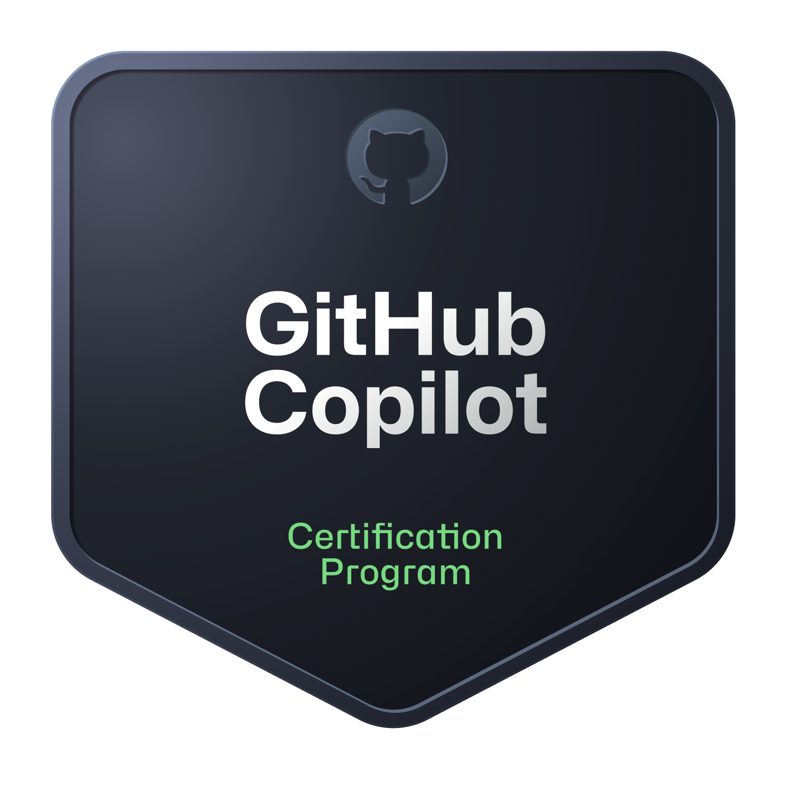
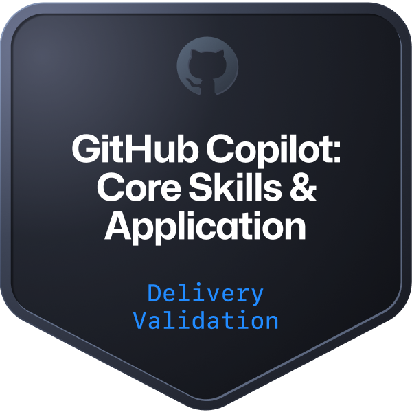
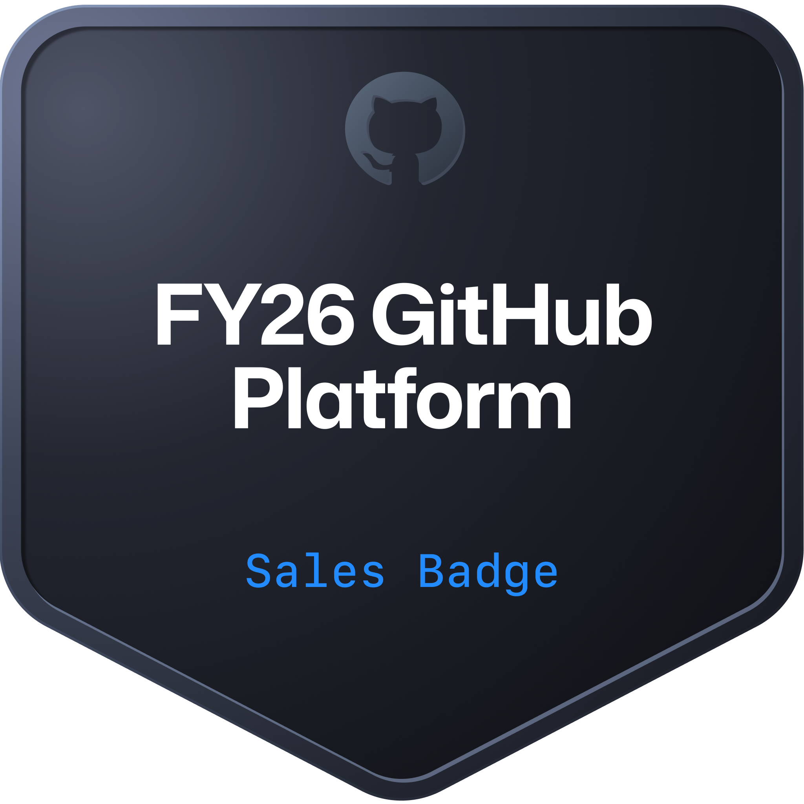
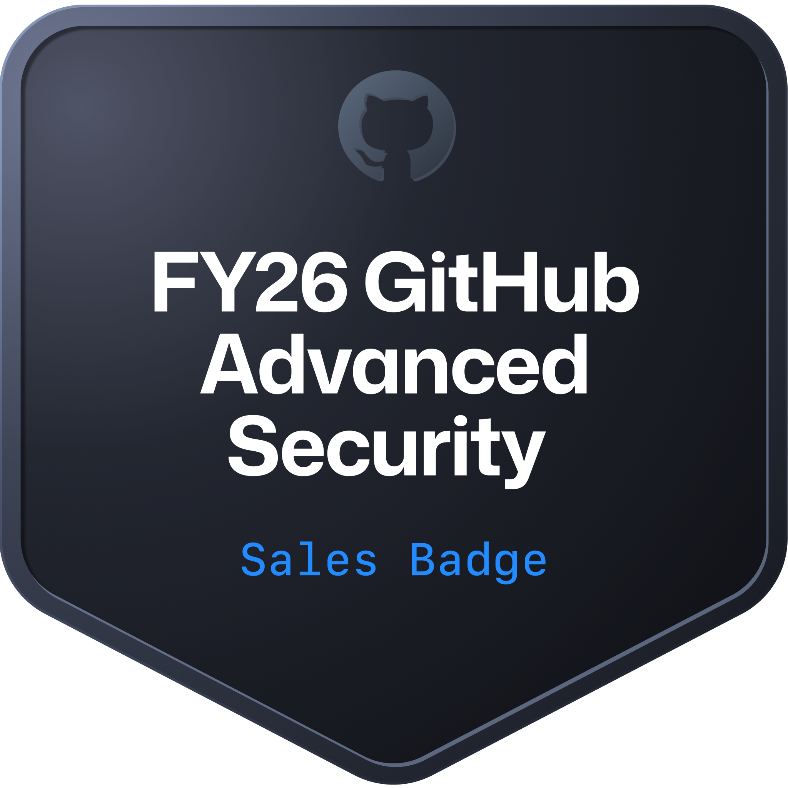
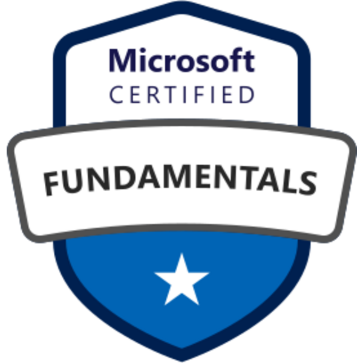
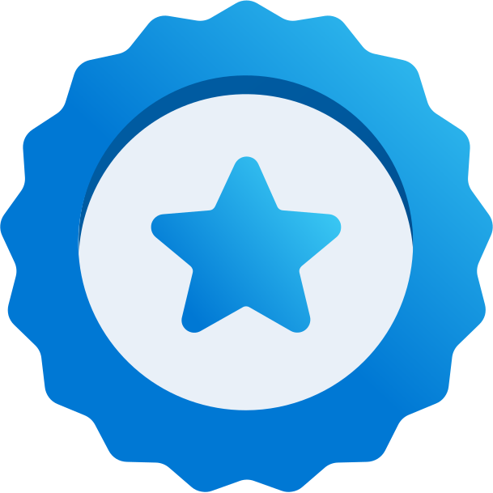

# 👋 Hi, I'm Barnes Chism

## 🚀 About Me

**DevOps Consultant @ Xebia | Azure | GitHub | CI/CD**

With over a decade of experience in DevOps engineering and consulting, I help teams develop and operate workloads on **Microsoft Azure** — the leading cloud platform for enterprise applications. I deliver high-quality solutions through pipeline automation, cloud architecture and security, and DevOps adoption.

I am passionate about helping teams improve their DevOps practices and culture, always learning new technologies and tools to enhance my capabilities — a self-assured, curious, continual learner who takes ownership of customer success and team development.

### 🎯 Key Areas of Expertise

- DevOps Consulting and Pipeline Automation
- Microsoft Azure Architecture and Operations
- GitHub Actions, Administration, and Advanced Security
- CI/CD Pipeline Design and Implementation
- Cloud Security and Governance
- DevOps Culture Adoption and Team Enablement

### 💡 Profile

Driven by a commitment to delivering excellent outcomes for clients and teams alike. My work sits at the intersection of automation, cloud infrastructure, and secure software delivery — helping organizations elevate their engineering practices and operate confidently at scale.

---

## 🏆 Certifications

### 🐱 GitHub

  
  
  
  
  

- **GitHub Actions**
- **GitHub Administration**
- **GitHub Advanced Security**
- **GitHub Copilot**
- GitHub Foundations

#### Partner Delivery Credentials

  
  
  
  

- GitHub Copilot: Core Skills & Application Partner Delivery Credential
- GitHub Advanced Security Partner Delivery Credential
- GitHub Migrations Partner Delivery Credential
- AzureDevOps to GitHub Migrations Partner Delivery Credential

#### Partner Sales Credentials

  
  
  
  
  
  

- GitHub Partner Technical Sales Professional Credential
- FY26 GitHub Partner Sales Professional
- FY26 GitHub Platform Partner Sales Credential
- FY26 GitHub Advanced Security Partner Sales Credential
- FY26 GitHub Copilot Partner Sales Credential
- FY26 GitHub Revenue Motions Partner Sales Credential

---

### ☁️ Microsoft Azure

  
  
  

- **Microsoft Certified: DevOps Engineer Expert**
- **Microsoft Certified: Azure Administrator Associate**
- Azure AI Fundamentals

---

### 🔧 Microsoft Applied Skills

  
  

- Automate Azure Load Testing by using GitHub Actions
- Accelerate AI-assisted development by using GitHub Copilot

---

## 📫 How to Find Me

- 💼 LinkedIn: [barnes-chism](https://www.linkedin.com/in/barnes-chism/)
- 🏆 Credly: [barnes-chism](https://www.credly.com/users/barnes-chism/badges)
- 🐱 GitHub: [@barneschism](https://github.com/barneschism)
